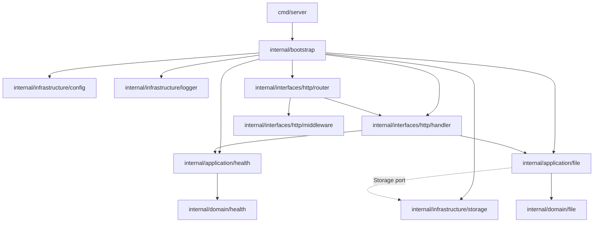
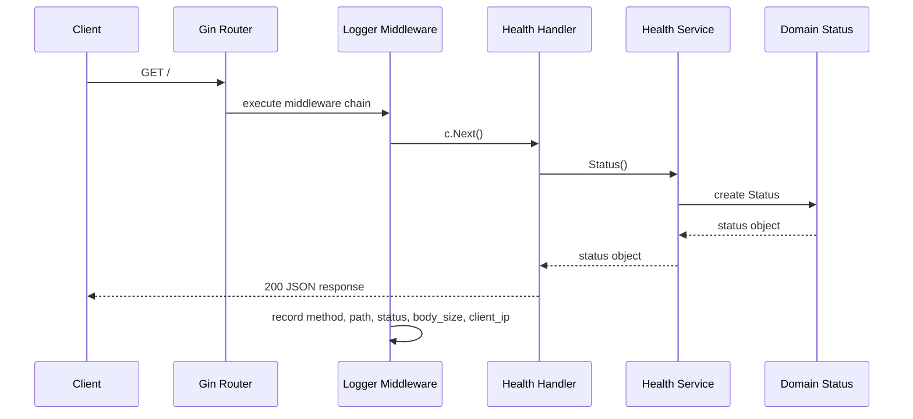
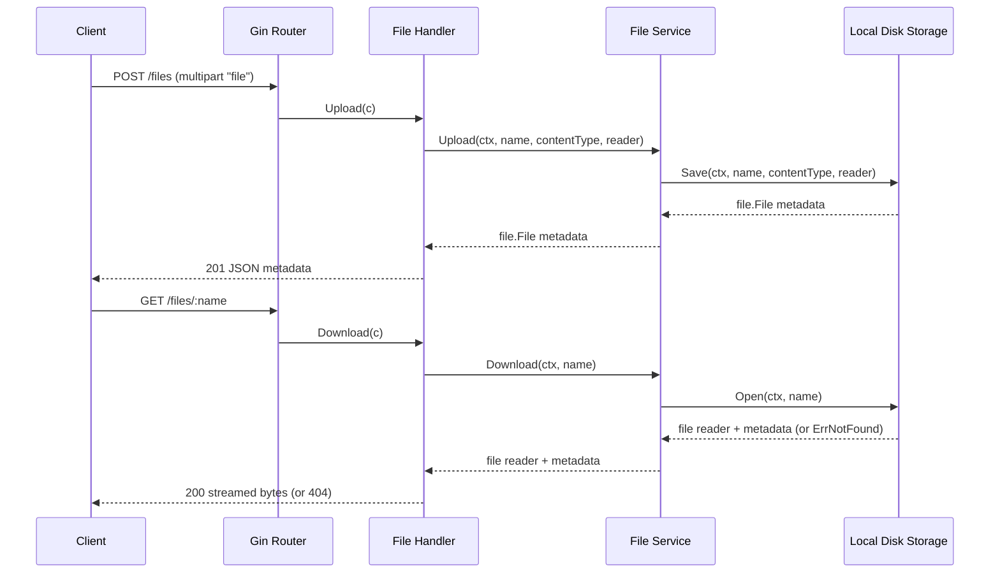
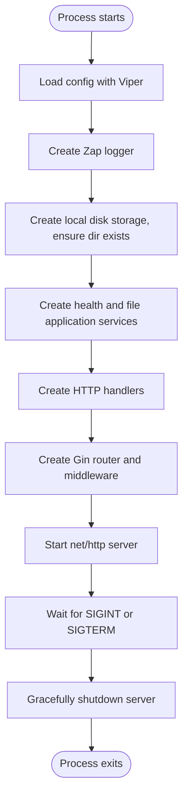
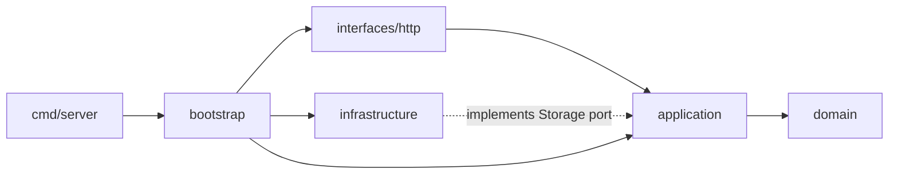

# Architecture

This project uses a small DDD-style / hexagonal layout. There is no database: uploaded files are
persisted directly on the local filesystem behind a `Storage` port, so the storage technology can
be swapped later without touching handlers or use cases.

## Layers

- `cmd/server`: starts the process, creates the HTTP server, and handles graceful shutdown.
- `internal/bootstrap`: wires configuration, logging, services, handlers, middleware, and routes.
- `internal/domain`: contains business objects (`health.Status`, `file.File`).
- `internal/application`: contains use cases and application services that operate on domain
  objects. `application/file` also defines the `Storage` port that infrastructure adapters
  implement.
- `internal/interfaces/http`: contains Gin handlers, middleware, and router setup.
- `internal/infrastructure`: contains technical concerns such as configuration, logging, and the
  `storage.Local` disk adapter.

## Package Relationship

## Health Request Flow

## File Upload / Download Flow

## Startup Algorithm

## Dependency Direction

Dependencies point inward toward the application and domain layers:

The router knows about HTTP handlers and middleware. The handler knows about the application
service interface. The application service depends on the `Storage` port, not on a concrete
storage technology. `infrastructure/storage` implements that port by writing to local disk;
infrastructure packages do not contain request handling or business behavior.
